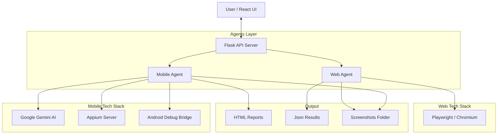

# 🤖 Local AI Testing Platform
### Unified Mobile & Web Automation Powered by Generative AI


**Local AI Testing Platform** is a modular automation framework that combines **Computer Vision**, **LLMs (Google Gemini)**, and **Headless Browsers** to stress-test your applications. It now supports both **Android** applications and **Websites** from a single, unified dashboard.

---

## 📋 Table of Contents
- [Overview](#-overview)
- [Features](#-features)
- [Architecture](#-architecture)
- [Prerequisites](#-prerequisites)
- [Installation](#-installation)
- [Configuration](#-configuration)
- [Usage](#-usage)
- [API Reference](#-api-reference)
- [Project Structure](#-project-structure)
- [Troubleshooting](#-troubleshooting)

---

## 🎯 Overview

This platform deploys autonomous agents to explore and test your software:

1.  **Mobile Agent**: Uses **Appium**, **ADB**, and **Google Gemini** to intelligently explore Android apps, detect crashes, fill forms, and validate user flows.
2.  **Web Agent**: Uses **Playwright** to crawl websites, capture screenshots, detect console errors, broken links, and network failures.

**Key Differiantiators:**
*   🧠 **AI-Driven (Mobile)**: Uses LLMs to decide *what* to click and *how* to test logic.
*   🕷️ **Smart Crawling (Web)**: Automatically traverses your site, capturing visual and console evidence.
*   📊 **Unified Reporting**: Detailed insights and screenshots for every test session.
*   🚀 **Local Execution**: Runs entirely on your machine—secure and fast.

---

## ✨ Features

### 📱 Mobile Testing (Android)
*   ✅ **Automated APK Installation**: Upload and install directly to emulator.
*   ✅ **AI Exploration**: Gemini AI creates test scenarios and navigates the app.
*   ✅ **Guided Testing**: Provide context (e.g., "Test the login flow") for targeted actions.
*   ✅ **Visual Analysis**: Captures screenshots to detect UI regressions.
*   ✅ **Crash Detection**: Monitors logs for app crashes.

### 🌐 Web Testing (Websites)
*   ✅ **Smoke Testing**: Validates site load, title, and critical resources.
*   ✅ **Multi-Page Crawling**: Automatically follows internal links to test up to 5 pages deep.
*   ✅ **Issue Detection**: Captures **Console Errors**, **404/500 Network Failures**, and **Broken Links**.
*   ✅ **Screenshot Capture**: Auto-generates screenshots for every visited page.
*   ✅ **Headless Execution**: Fast, background testing using Chromium.

---

## 🏗️ Architecture



---

## 🔧 Prerequisites

### System Requirements
*   **OS**: Windows 10/11, macOS, or Linux
*   **Python**: 3.8+
*   **Node.js**: 16.x+
*   **Browser**: Chrome/Chromium (managed by Playwright)

### For Mobile Testing
*   **Android Studio** (SDK + Emulator)
*   **Appium**: `npm install -g appium`
*   **Java JDK**: 11+
*   **Google Gemini API Key**: [Get it here](https://aistudio.google.com/)

---

## 📦 Installation

### 1. Clone Repository
```bash
git clone https://github.com/hasibnirjhar07/mobile-testing-agent-flask-react.git
cd mobile-testing-agent-flask-react
```

### 2. Backend Setup
```bash
# Create virtual environment
python -m venv venv

# Activate (Windows)
venv\Scripts\activate
# Activate (Mac/Linux)
source venv/bin/activate

# Install Python dependencies (includes Flask, Appium, Playwright)
pip install -r requirements.txt

# Install Playwright Browsers
playwright install
```

### 3. Frontend Setup
```bash
cd frontend
npm install
cd ..
```

### 4. Android Setup (Optional - for Mobile only)
Start your Android Emulator via Android Studio or command line:
```bash
emulator -avd Pixel_6_API_34 -no-snapshot-load &
```

---

## ⚙️ Configuration

1.  **Environment Variables**: Create a `.env` file in the root:
    ```env
    GEMINI_API_KEY=your_gemini_api_key_here
    ```

2.  **Config File**: `config/config.yaml` handles mobile settings (device ID, timeouts). Defaults are provided if missing.

---

## 🚀 Usage

### 1. Start the Platform
You need two terminals running simultaneously:

**Terminal 1 (Backend):**
```bash
python api_server.py
```

**Terminal 2 (Frontend):**
```bash
cd frontend
npm start
```

### 2. Access Dashboard
Open **[http://localhost:3000](http://localhost:3000)** in your browser.

### 3. Run a Test
*   **Mobile**: Upload an APK -> Select Mode (Auto/Guided) -> Start.
*   **Web**: Enter a URL (e.g., `https://example.com`) -> Click "Start Scan".

---

## 📡 API Reference

### 🌐 Web Endpoints

**Start Web Test**
*   `POST /api/web/start`
*   **Body**: `{"url": "https://example.com"}`
*   **Response**: `{"success": true, "session_id": "uuid"}`

---

### 📱 Mobile Endpoints

**Start Mobile Test**
*   `POST /api/mobile/start`
*   **Body**: `{"session_id": "...", "test_mode": "auto", "credentials": {...}}`

**Upload APK**
*   `POST /api/upload`
*   **Body**: Form-data with `file`.

---

### Common Endpoints

**Get Status**
*   `GET /api/test/status/{session_id}`
*   **Response**: `{"status": "running|completed", "progress": 50, "results": {...}}`

---

## 📁 Project Structure

```text
mobile-testing-agent/
├── agents/
│   ├── mobile/           # Mobile (Appium) Agent Logic
│   │   ├── ai_agent_core.py
│   │   └── ui_explorer.py
│   └── web/              # Web (Playwright) Agent Logic
│       └── web_agent.py
├── api_server.py         # Flask Main Entry Point
├── frontend/             # React Application
│   ├── src/components/   # WebTest, MobileTest, Dashboard
│   └── App.js
├── reports/              # Generated HTML/Json Reports
├── screenshots/          # Captured Error Screenshots
├── uploads/              # Temp APK Storage
└── requirements.txt      # Python Dependencies
```

---

## 🐛 Troubleshooting

| Issue | Solution |
|-------|----------|
| **Server Restarting Loop** | We disabled the Flask reloader in `api_server.py` to prevent restarts when screenshots are saved. Ensure you restart the script manually after code changes. |
| **"Brain is not defined"** | Fixed in Frontend. Make sure you pulled the latest changes or check `LandingPage.js` imports. |
| **Playwright Browers Missing** | Run `playwright install` in your terminal. |
| **Appium Connection Failed** | Ensure Appium server is running in a separate terminal via `appium`. |

---
*Made with ❤️ by the Advanced Agentic Coding Team*
